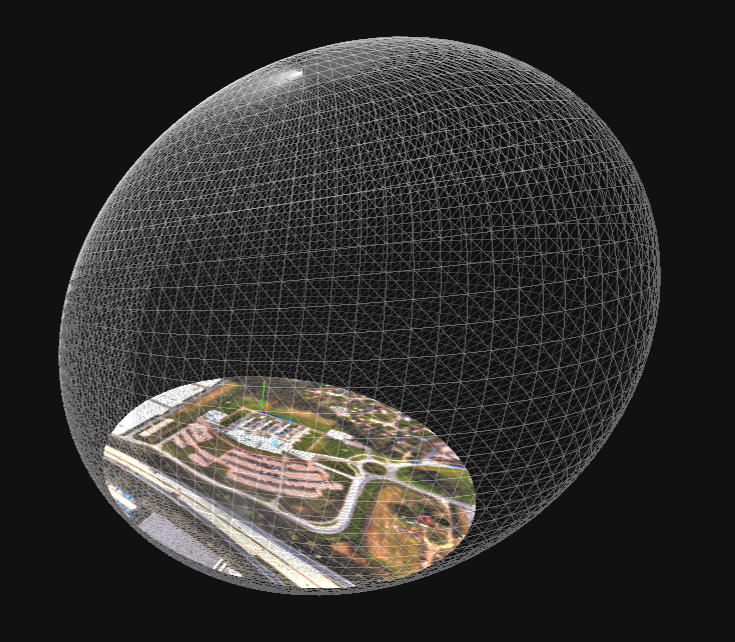

<!--
Copyright 2015-2021 The Khronos Group Inc.
SPDX-License-Identifier: CC-BY-4.0
-->

# **OGC_bog**: An Extension to Bound, Orient, and Geolocate a glTF Scene.

## Contributors

* Jan-Erik Vinje, _, _@_
* Rob Smith, _, _@_
* Jeremy Morley, _, _@_
* .
* .
* Christine Perey, PEREY Research & Consulting, cperey@perey.com
* Steve Smyth, co-Chair OGC GeoPose SWG, steve@opensiteplan.org

## Status

Draft

## Dependencies

Written against the glTF 2.0 spec and the OGC GeoPose 1.0 standard.

## Overview

The OGC_bog extension bounds, anchors, and orients a glTF Scene in space and time. 

### Bounds: 
The extension specifies spatial bounds as a maximum distance in meters from the origin of the glTF coordinate system. This defines the valid extent of a model. It may represent a real-world property such as a cell-tower service radius or a collision volume.

### Anchor: 
The extension links the "floating" 3D origin of the glTF coordinate system to a position in geographically located three-dimensional space. The extension also identifies the proper time, measured by a clock at the origin, and well-defined even with very high velocities between unaccelerated reference frames. 

### Orientation: 
The extension provides the 3D rotational relationship between that 3D Cartesian coordinate system and coordinates in an East(X), North(Y), Up(Z) plane tangent to the earth at the origin, using a JSON-encoded Basic-YPR OGC GeoPose v1.0. 

### Use cases:
1. Publication of CityGML models in glTF 2.
2. Preloading of visual perception systems.
3. Exchange of visual perception fragments from vehicle mounted mobile platfforms.
4. Archive of geolocated surveillance video, including video with WebVMT tracks.

## glTF Schema Updates

The OGC_bog is a JSON object carrying the bounds, orientation, and geolocation parameters of a scenegraph. It becomes an additional property of a glTF Scene object. If a glTF model contains multiple Scenes, it may contain multiple OGC_bog properties. A Scene shall **not** have more than one OGC_bog property.

### JSON Schema

[JSON-Schema](https://github.com/opengeospatial/GeoPose/blob/Version-1.x-editors-/glTF%20Extensions/OGC_bog/OGC_bog_schema.json)

## Known Implementations

* Hillyfields Bubble [JSON object](https://github.com/opengeospatial/GeoPose/blob/Version-1.x-editors-/glTF%20Extensions/OGC_bog/OGC_bog_example.json) .

* .
* .

## Resources

* .
* .
* .
