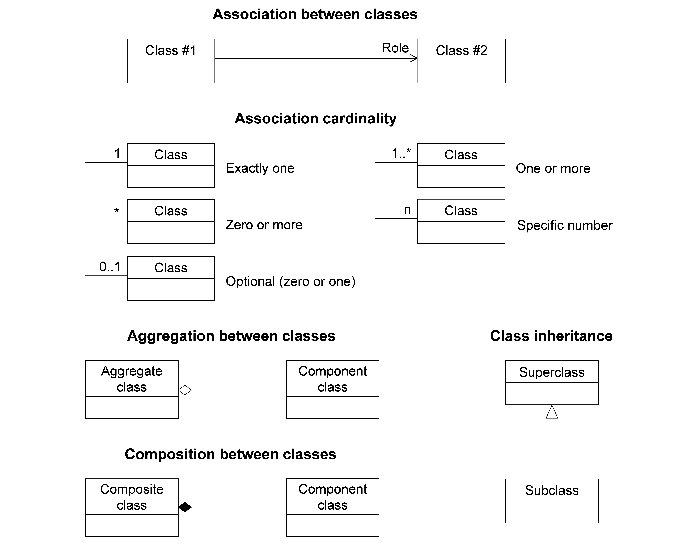
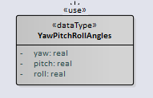
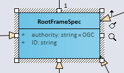
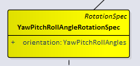
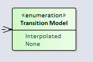

== Conventions

This section provides details and examples for conventions used in this document.

=== Identifiers

The normative provisions in this document are denoted by the URI

http://www.opengis.net/spec/GeoPose/1.0

All requirements and conformance tests that appear in this document are denoted by partial URIs which are relative to this base.

=== Use Cases, Concepts, Logical Model, Standardization Targets, Encodings

=== UML Notation

The logical structure of the elements used in the GeoPose Standard is presented in this document in diagrams using the Unified Modeling Language (UML) static structure diagram (see Booch et al. 1997). The UML notations used in this standard are described in the diagram in <<figure-1>>.

[[figure-1]]
.UML notation (<<iso19103>>)

All associations between model elements in GeoPose are uni-directional. Thus, associations in GeoPose are navigable in only one direction. The direction of navigation is depicted by an arrowhead. In general, the context an element takes within the association is indicated by its role. The role is displayed near the target of the association. If the graphical representation is ambiguous though, the position of the role has to be drawn to the element the association points to.

In order to enhance the readability of the GeoPose UML diagrams, classes are depicted in different colors. The following coloring scheme is applied:

[[fig2]]
.Data Types

Classes painted in grey represent data types.

[[fig3]]
.Blue Color Denotes Abstract or More General Classes

Classes painted in blue are internal less-derived elements that are not themselves directly encoded as concrete data objects.

[[fig4]]
.Yellow Color Denotes Structural Data Units

Classes painted in yellow correspond to Structural Data Units or have properties that are represented in Structural Data Units and in encodings of those SDUs. Only data types and classes painted yellow are encoded as concrete data objects.

[[fig5]]
.Green Color Denotes Enumeration

Enumerations are painted in green.

[[fig6]]
.White Color Denotes a Note or Constraint
image::images/White_UML.png[]

The color white is used for notes and OCL constraints that are provided in the UML diagrams.

