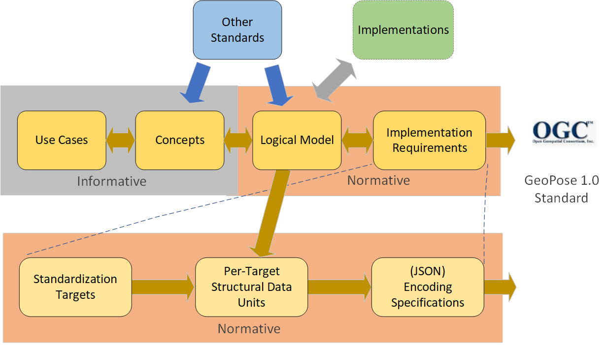

== Conceptual model

=== General

<<iso19101>> defines universe of discourse to be a view of the real or hypothetical world that includes everything of interest. That standard then defines conceptual model to be a model that defines concepts of a universe of discourse.

The goal of this GeoPose Standard is to establish and document a common set of concepts that spans the targeted use cases. This does not attempt to redefine application concepts, but merely present a common set of concepts from and to which their concepts can be understood and mapped.

The GeoPose conceptual model is a graph of related concepts. One technology-independent realization is given by the GeoPose Logical Model.

The GeoPose conceptual model (CM) consists of linked definitions of terms denoting concepts expressed in the GeoPose logical model (LM) and structural data unit (SDU) specifications for the standardization targets.

The CM describes a (non-normative) domain of discourse for terms used in defining a precise and normative Logical Model (LM) expressed as a Unified Modelling Language (UML) class diagram.

The scope of the standardization targets is a subset of the scope of the LM. The scope of the LM is a subset of the scope of the Conceptual Model. The standardization targets are mutually independent implementations of subsets of the LM.

=== Temporal concepts and reference frame

The only temporal frame used in this GeoPose standard is "Unix Time": seconds since the Unix Epoch of 1 January 1970 measured by a virtual "Unix clock", ticking once per "Unix second", and omitting any corrections such as leap seconds.

Times before 1 January 1972 are not precisely related to another temporal frame but the value at UTC 1 January 1972 was +63,072,000.
This allows precise conversion to and from modern temporal frames.

NOTE: This standard does not reference a calendar and encoded values are representations of the count of seconds, rather than a calendar-relative date and time. These times may be converted to UTC and expressed as text (e.g. with <<iso8601-1>> and <<iso8601-2>>) relative to a specific calendar but this is outside the scope of this standard.

Temporal concepts defined in this document are intended to align with terms used in <<owl-time>>.

=== Document structure

The structure of the GeoPose Standard document flows from:

* use cases to the definition of a conceptual domain of discourse comprehensive enough to support those use cases,

* a realization of a portion of that conceptual domain with an implementation-neutral but specific and normative logical data model expressed in UML, and

* the normative derivation of specific structural data units that represent abstract implementation and standardization targets.

These Structural Data Units (SDUs) are abstract: they are independent of implementation or delivery technology and serialization or encoding formats. GeoPose Version 1.0 specifies one of many possible realizations of the structural data units in JSON.

A key aspect of the GeoPose Standard is that specific use cases are tied to the standardization targets, which prescribe the structure and content of GeoPose data objects. Corresponding implementation examples appear in other documents.

Of course, GeoPose must incorporate or align with other relevant existing standards and common practices. The goal is to fill an interoperability gap in existing standards without reinventing technology in a way that encourages interoperability.

[[fig7]]
.Document Structure Overview

[[use_case_summary]]
=== Use Case Summary

include::use_cases/use_cases.adoc[]
