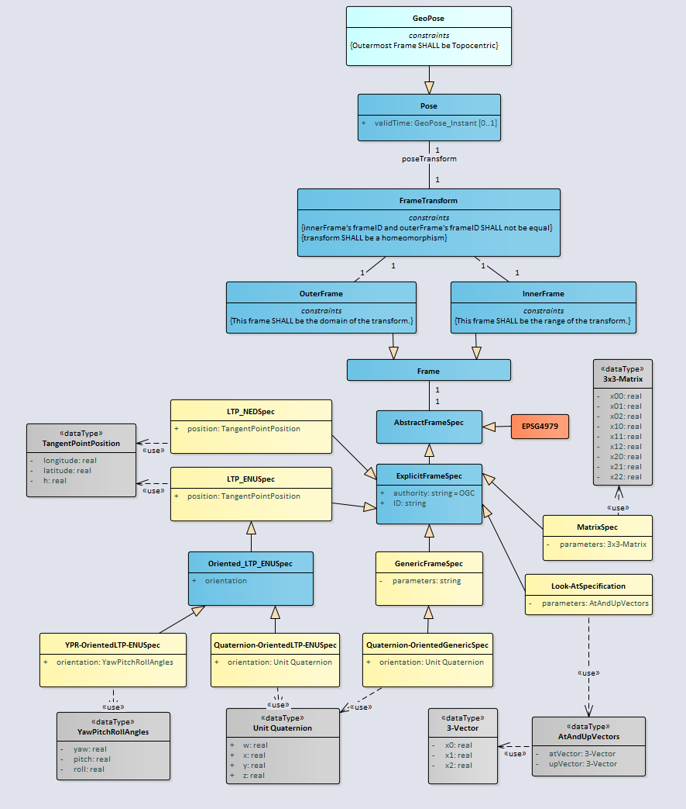
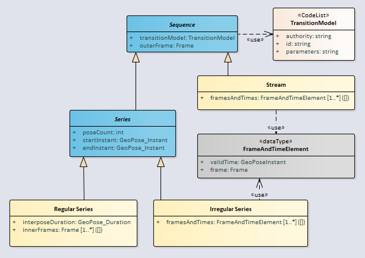
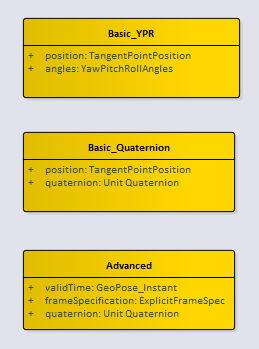
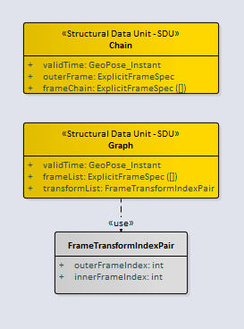
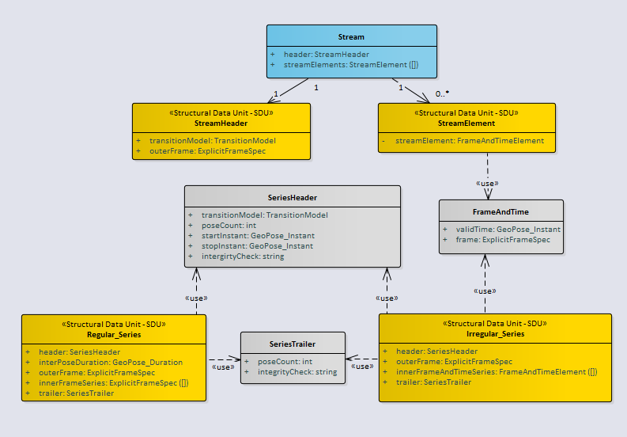
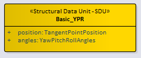
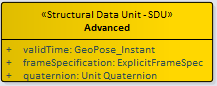
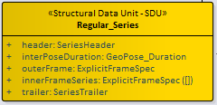

== Logical Model

=== Description (Informative)

The Frame Transform is the core abstraction in the GeoPose Standard. The Frame Transform is a representation of the transformation taking an Outer Frame coordinate system to an Inner Frame coordinate system. This abstraction is constrained in GeoPose v 1.0 to only allow transformations involving translation and rotation. The intention is to match the usual concept of a pose as a position and orientation. The formalism that expresses a GeoPose Frame Transform is a pair of Reference Frames, Outer and Inner, each defined by a Frame Specification. The Logical Model relates these elements to represent different types of GeoPose data objects and also defines structures built of time series and linked GeoPoses.

=== UML Logical Model

The normative expression of the UML model is a Sparx Systems Enterprise Explorer link:https://github.com/opengeospatial/GeoPose/blob/main/standard/standard/models/Model.eapx[project ("eapx")file].

The Logical Model consists of four top-level packages: Core, Time, Sequence, and Targets. The Targets package contains two detail packages: Basic and Composite. The Composite package is in turn subdivided into a Linked package and a Sequence package. The Basic GeoPose targets depend on only the Core package. The Advanced GeoPose target also depends on the Time Package. Composite GeoPoses depend on all four top-level packages.

The coloring of the classes indicates their role in the logical design. Note that the classes and data types defined in the Target packages are the source of structural data units (SDUs) that may be realized as concrete data objects.

==== Core

The Logical Model Core contains the essential elements specific to the GeoPose modelled as a transformation between an anchoring Outer Frame and one or more derived Inner Frames.

[[metadata_governance]]
.Core Logical Model

==== Time

The time logical model is based on the link:https://www.w3.org/TR/2020/CR-owl-time-20200326/[OWL Time] document.

Only relevant classes, properties, and associations are included. GeoPose v1.0 has a very restricted idea of time position, limited to seconds of UNIX Time.

[[core_logical_model]]
.Time Logical model
image::models/Logical_time.png[]

==== Sequence

The sequence logical model defines a method for packaging of GeoPose data, where multiple GeoPoses in a sequence share the same <<def_Outer_Frame,*Outer Frame*>> and there is a time-dependent changing <<def_Inner_Frame,*Inner Frame*>>.

[[sequence_logical_model]]
.Sequence Logical Model

==== Targets

The Logical Model's Targets package specify the design of logical data objects and data types that are directly expressed in GeoPose data objects.

The Basic-YPR, Basic-Quaternion, and the Advanced GeoPose SDUs represent single GeoPose objects.

[[basic_advanced_logical_model]]
.Basic and Advanced Structural Data Units

The Chain and the Graph GeoPose composite structures respectively represent linear or branching frame transformation relationships.

[[chain_graph_logical_model]]
.Chain and Graph Structural Data Units

The Stream and each of the two Series composite structures represent time series of a single evolving GeoPose.

[[series_and_stream_model]]
.Series and Stream Structural Data Units

[NOTE]
The _integrityCheck_ attributes in the SeriesHeader and SeriesTrailer classes are defined as strings and have no prescribed method of use in GeoPose 1.0. They are placeholders to allow experimentation and possible standardization in a later version.

[[requirements]]
== Structural Data Units and Standardization Targets

=== Description (Informative)

Classes, attributes, and relationships of the GeoPose domain are specified in a (normative) GeoPose UML static class model - the GeoPose Logical Model. Standardization Targets are specified by encoding-neutral elements of the Logical Model. These Structural Data Units (SDUs) are elements (classes or attributes) in the Logical Model with the "Structural Data Unit - SDU" stereotype. SDUs may have additional Requirements limiting the range, multiplicity, representation or other constraining and testable characteristics. SDUs are used individually or in combination combined to express each of the Standardization Targets.

SDUs provide Standardization Targets that are independent of serialization/encoding format. This allows multiple equivalent serializations to be defined. Each SDU that may be expressed as a concrete data object is associated with a corresponding element (class or attribute) in the logical model.

[[standardization_targets]]
The Basic and Advanced Standardization Targets differ in the level of options and flexibility in the Frame Specifications. The Composite Targets offer approaches to packaging Frame Transforms. The Targets are the data classes that are specified by the GeoPose Standard. There are eight Standardization Targets denoted by bold terms in the following categories:

. Basic - Satisfy most use cases
.. Orientation by Yaw, Pitch, and Roll (YPR) rotations about z, y, x axes: *Basic-YPR* Target
.. Orientation by unit quaternion: *Basic-Quaternion* Target
. Configurable - Flexible enough for complex use cases including full 6DoF transformations: *Advanced* Target
. Composite - Efficient structures for linked and sequential GeoPoses
.. Linked linear sequence of poses linked by full 6DoF transformations: *Chain* Target
.. General linked poses: *Graph* Target
.. Sequence
... Series
.... Time series with constant time spacing: *Regular* Time series Target
.... Time series with per-GeoPose time: *Irregular* Time series Target
... Open-ended sequence of time-stamped GeoPoses: *Stream* Target

[NOTE]
The definition of a reference frame by an external standard in *not* specified. GeoPose does use a three-part designation of an external frame specification using the three fields _authority_, _ID_, and _parameters_. The interpretation of the contents of these fields is outside the scope of GeoPose.

=== Global Requirements

Global requirements apply to all SDUs and Standardization Targets.

[[rc_global]]
[requirements_class]
====
[%metadata]
label:: /req/global
subject:: SDU
description:: Global SDU Requirements
requirement:: /req/target_dependency
requirement:: /req/sdu_general
requirement:: /req/lm_general
====

The individual global requirements are defined as follows:

[[global]]
[requirement]
====
[%metadata]
label:: /req/target_dependency
description:: There SHALL be no dependency between or among the individual Standardization Targets.
====

[[sdu_confomance]]
[requirement]
====
[%metadata]
label:: /req/sdu_general
description:: Implementations using encoded SDUs SHALL conform to the logical description of the Logical Model elements with the "Structural Data Unit - SDU" stereotype.
====

[[lm_confomance]]
[requirement]
====
[%metadata]
label:: /req/lm_general
description:: Implementations of concrete data conforming to this standard SHALL conform to all dependent or inherited classes, attributes, and associations, multiplicities, and data types in the Logical Model.
====

==== Requirements for Standardization Target 1: Basic-YPR

*Summary (Informative)*

The Basic-YPR Target has a simple structure with no options. Position is specified as a point in an LTP-ENU frame and rotation is specified by yaw, pitch, and roll angles specified in decimal degrees.

*Structure*

[[basic_ypr_sdu]]
.Basic YPR SDU

*Requirements Class*

[[req_class_basic_ypr_sdu]]
[requirements_class]
====
[%metadata]
label:: /req/basic_ypr/sdu
subject:: Implementation of Logical Model
description:: Basic-YPR Logical Model SDU
inherit:: /req/global
requirement:: /req/basic_ypr/sdu
requirement:: /req/tangent_plane_longitude/sdu
requirement:: /req/tangent_plane_latitude/sdu
requirement:: /req/tangent_plane_h/sdu
requirement:: /req/orientation_ypr_angles/sdu
====

Details of the individual requirements:

[[req_basic_ypr_sdu]]
[requirement]
====
[%metadata]
label:: /req/basic_ypr/sdu
description:: An implementation of a Basic-YPR Target SHALL consist of an Outer Frame specified by an implicit WGS-84 CRS and an implicit EPSG 4461-CS (LTP-ENU) coordinate system and explicit parameters to define the tangent point. The Inner Frame SHALL be a rotation-only transformation using Yaw, Pitch, and Roll angles specified in degrees and represented as signed real number values.
====

[[req_tangent_plane_longitude]]
[requirement]
====
[%metadata]
label:: /req/tangent_plane_longitude/sdu
description:: An instance of a GeoPose tangentPoint.longitude attribute SHALL be expressed as decimal degrees and represented as signed real number values.
====

[[req_tangent_plane_latitude]]
[requirement]
====
[%metadata]
label:: /req/tangent_plane_latitude/sdu
description:: An instance of GeoPose tangentPoint.latitude attribute SHALL be expressed as decimal degrees and represented as signed real number values.
====

[[req_tangent_plane_h]]
[requirement]
====
[%metadata]
label:: /req/tangent_plane_h/sdu
description:: An instance of a GeoPose tangentPoint.h attribute SHALL be expressed as a height in meters above the WGS-84 ellipsoid and represented as a signed real number value.
====

[[req_sdu_orientation_ypr_angles]]
[requirement]
====
[%metadata]
label:: /req/orientation_ypr_angles/sdu
description:: Yaw, Pitch, and Roll (YPR) angles SHALL be expressed as three consecutive rotations of a reference frame oriented East-North-Up (ENU) coordinate system (where the coordinate axes East, North, and Up correspond to the axes X, Y, Z) about the local (rotated) axes z, y, and x, applied in that order, corresponding to the conventional Yaw, Pitch, and Roll angles. The unit of measure SHALL be the degree and the angles represented as signed real number values.
====

==== Requirements for Standardization Target 2: Basic-Quaternion

*Summary (Informative)*

The Basic-Quaternion Target has a simple structure with no options. Position is specified as a point in an LTP-ENU frame and rotation is specified as a unit quaternion.

*Structure*

[[basic_quaternion_sdu]]
.Basic Quaternion SDU
image::diagram/Basic-Quaternion_SDU.PNG[]

*Requirements Class*

[[req_basic_quaternion_sdu]]
[requirements_class]
====
[%metadata]
label:: /req/basic_quaternion/sdu
subject:: Implementation of Logical Model
inherit:: /req/global
description:: Basic-Quaternion Logical Model SDU

requirement:: /req/tangent_plane_longitude/sdu
requirement:: /req/tangent_plane_latitude/sdu
requirement:: /req/tangent_plane_h/sdu
requirement:: /req/orientation_quaternion/sdu
====

[requirement]
====
[%metadata]
name:: B-TP-Lon-SDU
label:: /req/tangent_plane_longitude/sdu
description:: An instance of a GeoPose tangentPoint.longitude attribute SHALL be expressed as decimal degrees, represented as a signed real number.
====

[requirement]
====
[%metadata]
name:: B-TP-Lat-SDU
label:: /req/tangent_plane_latitude/sdu
description:: An instance of GeoPose tangentPoint.latitude attribute SHALL be expressed as decimal degrees, represented as a signed real number.
====

[requirement]
====
[%metadata]
name:: B-TP-h-SDU
label:: /req/tangent_plane_h/sdu
description:: An instance of a GeoPose tangentPoint.h attribute SHALL be expressed as a height in meters above the WGS-84 ellipsoid, represented as a signed real number. If the tangent point is above the WGS-84 ellipsoid, the value SHALL be positive. If the tangent point is below the WGS-84 ellipsoid, the value SHALL be negative.
====

[NOTE]
The tangent plane longitude, latitude, and h parameters are specified without any conditions or constraints on precision to be used in an implementation. Any such constraints would be found as requirements on a specific implementation as an encoding.

[[req_sdu_orientation_quaternion]]
[requirement]
====
[%metadata]
name:: B-Quaternion-SDU
label:: /req/orientation_quaternion/sdu
description:: An instance of a GeoPose Logical Model quaternion data type value SHALL be expressed as four real numbers, representing four quaternion components w, x, y, z, in that sequential order. The sum of the squares of the individual components SHALL be as close to 1.0 as the real number representation allows. The quaternion SHALL be applied to an initial reference frame oriented East-North-Up (ENU) coordinate system where the coordinate axes East, North, and Up correspond to the axes X, Y, Z.
====

==== Requirements for Standardization Target 3: Advanced

*Summary (Informative)*

The Advanced Target has a more general structure, supporting flexible specification of Outer Frame and a Valid Time.

*Structure*

[[advanced_sdu]]
.Basic Advanced SDU

[[req_advanced]]
*Requirements Class*

[[req_advanced_sdu]]
[requirements_class]
====
[%metadata]
label:: /req/advanced/sdu
subject:: Implementation of Logical Model
description:: Advanced Logical Model SDU
inherit:: /req/global

requirement:: /req/advanced/sdu
requirement:: /req/time/geopose_instant/sdu
requirement:: /req/frame_specification_authority/sdu
requirement:: /req/frame_specification_id/sdu
requirement:: /req/frame_specification_parameters/sdu
requirement:: /req/orientation_quaternion/sdu
====

[[req_pose_geopose_instant_sdu]]
[requirement]
====
[%metadata]
name:: GP-Instant-SDU
label:: /req/time/geopose_instant/sdu
description:: The Logical Model attribute GeoPoseInstant SHALL be expressed in Unix Time in seconds multiplied by 1,000. The unit of measure SHALL be milliseconds.
====

[[req_frame_specification_authority_sdu]]
[requirement]
====
[%metadata]
name:: FS-Authority-SDU
label:: /req/frame_specification/authority/sdu
description:: The frame_specification.authority attribute SHALL contain a string uniquely specifying a source of reference frame specifications.
====

[[req_frame_specification_id_sdu]]
[requirement]
====
[%metadata]
name:: FS-ID-SDU
label:: /req/frame_specification/id/sdu
description:: The frame_specification.ID attribute SHALL be a string uniquely defining a frame within the authority.
====

[[req_frame_specification_parameters_sdu]]
[requirement]
====
[%metadata]
name:: FS-Parameters-SDU
label:: /req/frame_specification/parameters/sdu
description:: The frame_specification.parameter attribute SHALL contain all parameters needed for the corresponding authority and ID. The definition of these parameters is outside the scope of GeoPose.
====

[requirement]
====
[%metadata]
name:: Quaternion-SDU
label:: /req/orientation/quaternion/sdu
description:: An instance of a GeoPose Logical Model quaternion data type value SHALL be expressed as four real numbers, representing four quaternion components w, x, y, z, in that sequential order. The sum of the squares of the individual components SHALL be as close to 1.0 as the real number representation allows. The quaternion SHALL be applied to an initial reference frame oriented East-North-Up (ENU) coordinate system where the coordinate axes East, North, and Up correspond to the axes X, Y, Z.
====

==== Requirements for Standardization Target 4: Graph

*Summary (Informative)*

The Graph Target supports a network of object relative poses. The graph is a directed acyclic graph, each node must either be an Extrinsic Frame or reachable from an Extrinsic Frame.

[[req_graph]]

*Structure*

[[graph_sdu]]
.Graph SDU
image::diagram/Graph_SDU.PNG[]

[[req_graph_sdu]]
[requirements_class]
====
[%metadata]
label:: /req/graph/sdu
subject:: Implementation of Logical Model
description:: Graph Logical Model SDU
inherit:: /req/global

requirement:: /req/graph/sdu
requirement:: /req/geopose_instant/sdu
requirement:: /req/frame_specification_authority/sdu
requirement:: /req/frame_specification_id/sdu
requirement:: /req/frame_specification_parameters/sdu
requirement:: /req/transform_index/sdu
====

[requirement]
====
[%metadata]
name:: Graph-SDU
label:: /req/time/geopose_instant/sdu
description:: The Logical Model attribute GeoPoseInstant SHALL be expressed in Unix Time in seconds multiplied by 1,000. The unit of measure SHALL be milliseconds.
====

[requirement]
====
[%metadata]
name:: FS-Authority-SDU
label:: /req/frame_specification/authority/sdu
description:: The frame_specification.authority attribute SHALL contain a string uniquely specifying a source of reference frame specifications.
====

[requirement]
====
[%metadata]
name:: FS-ID-SDU
label:: /req/frame_specification/id/sdu
description:: The frame_specification.ID attribute SHALL be a string uniquely defining a frame within the authority.
====

[requirement]
====
[%metadata]
name:: FS-Parameters-SDU
label:: /req/frame_specification/parameters/sdu
description:: The frame_specification.parameter attribute SHALL contain all parameters needed for the corresponding authority and ID.
====

[requirement]
====
[%metadata]
name:: Transform_Index-SDU
label:: /req/chain/transform_index/sdu
description:: Each index value in a FrameListTransformPair SHALL be a distinct integer value between 0 and one less than the number of elements in the frameList property.
====

==== Requirements for Standardization Target 5: Chain

*Summary (Informative)*

The Chain Target supports relationships between a linear sequence of pose relationships. The first frame in the sequence must be an Outer Frame.

*Structure*

[[chain_sdu]]
.Chain SDU
image::diagram/Chain_SDU.PNG[]

[[req_chain_sdu]]
[requirements_class]
====
[%metadata]
label:: /req/chain/sdu
subject:: Implementation of Logical Model
description:: Chain Logical Model SDU
inherit:: /req/global

requirement:: /req/chain/sdu
requirement:: /req/time/geopose_instant/sdu
requirement:: /req/frame_specification_authority/sdu
requirement:: /req/frame_specification_id/sdu
requirement:: /req/frame_specification_parameters/sdu
====

[requirement]
====
[%metadata]
name:: GP-Instant-SDU
label:: /req/time/geopose_instant/sdu
description:: The Logical Model attribute GeoPoseInstant SHALL be expressed in Unix Time in seconds multiplied by 1,000. The unit of measure SHALL be milliseconds.
====

[requirement]
====
[%metadata]
name:: FS-Authority-SDU
label:: /req/frame_specification/authority/sdu
description:: The frame_specification.authority attribute SHALL contain a string uniquely specifying a source of reference frame specifications.
====

[requirement]
====
[%metadata]
name:: FS-ID-SDU
label:: /req/frame_specification/id/sdu
description:: The frame_specification.ID attribute SHALL be a string uniquely defining a frame within the authority.
====

[requirement]
====
[%metadata]
name:: FS-Parameters-SDU
label:: /req/frame_specification/parameters/sdu
description:: The frame_specification.parameter attribute SHALL contain all parameters needed for the corresponding authority and ID.
====

==== Requirements for Standardization Target 6: Regular Series

*Summary (Informative)*

The Regular (Time) Series Target represents the time evolution of a single GeoPose, with a constant time duration between successive inner frames.

*Structure*

[[req_sequence_series_regular]]

[[regular_series_sdu]]
.Regular Series SDU

[[req_regular_series_sdu]]
[requirements_class]
====
[%metadata]
label:: /req/regular_series/sdu
subject:: Implementation of Logical Model
description:: Regular Series Logical Model SDU
inherit:: /req/global

requirement:: /req/regular_series_header/sdu
requirement:: /req/time/geopose_duration/SDU
requirement:: /req/frame_specification_authority/sdu
requirement:: /req/frame_specification_id/sdu
requirement:: /req/frame_specification_parameters/sdu
requirement:: /req/regular_series_trailer/sdu
====

[requirement]
====
[%metadata]
name:: S-Header-SDU
label:: /req/regular_series/header/sdu
description:: A header property SHALL be implemented as a SeriesHeader structure.
====

[requirement]
====
[%metadata]
name:: GP-Duration-SDU
label:: /req/time/geopose_duration/SDU
description:: An interposeDuration property SHALL be implemented as a GeoPoseDuration.
====

[requirement]
====
[%metadata]
name:: FS-Authority-SDU
label:: /req/frame_specification/authority/sdu
description:: The frame_specification.authority attribute SHALL contain a string uniquely specifying a source of reference frame specifications.
====

[requirement]
====
[%metadata]
name:: FS-ID-SDU
label:: /req/frame_specification/id/sdu
description:: The frame_specification.ID attribute SHALL be a string uniquely defining a frame within the authority.
====

[requirement]
====
[%metadata]
name:: FS-Parameters-SDU
label:: /req/frame_specification/parameters/sdu
description:: The frame_specification.parameter attribute SHALL contain all parameters needed for the corresponding authority and ID.
====

[requirement]
====
[%metadata]
name:: S-Trailer-SDU
label:: /req/series/regular/trailer/sdu
description:: A trailer property SHALL be implemented as a SeriesTrailer structure.
====

==== Requirements for Standardization Target 7: Irregular Series

*Summary (Informative)*

The Irregular (Time) Series Target represents the time evolution of a single GeoPose, with a variable time duration between successive inner frames.

*Structure*

[[req_sequence_series_irregular]]

[[irregular_series_sdu]]
.Irregular Series SDU
image::diagram/Irregular-Series_SDU.PNG[]

[[req_irregular_series_sdu]]
[requirements_class]
====
[%metadata]
label:: /req/irregular_series/sdu
subject:: Implementation of Logical Model
description:: Irregular Series Logical Model SDU
inherit:: /req/global

requirement:: /req/irregular_series_header/sdu
requirement:: /req/frame_specification_authority/sdu
requirement:: /req/frame_specification_id/sdu
requirement:: /req/frame_specification_parameters/sdu
requirement:: /req/irregular_series_frame_and_time/SDU
requirement:: /req/regular_series_trailer/sdu
====

[requirement]
====
[%metadata]
name:: S-IHeader-SDU
label:: /req/irregular_series_header/sdu
description:: A header property SHALL be implemented as a SeriesHeader.
====

[requirement]
====
[%metadata]
name:: FS-Authority-SDU
label:: /req/frame_specification_authority/sdu
description:: The frame_specification.authority attribute SHALL contain a string uniquely specifying a source of reference frame specifications.
====

[requirement]
====
[%metadata]
name:: FS-ID-SDU
label:: /req/frame_specification_id/sdu
description:: The frame_specification.ID attribute SHALL be a string uniquely defining a frame within the authority.
====

[requirement]
====
[%metadata]
name:: FS-Parameters-SDU
label:: /req/frame_specification_parameters/sdu
description:: The frame_specification.parameter attribute SHALL contain all parameters needed for the corresponding authority and ID.
====

[requirement]
====
[%metadata]
name:: S-FT-Element-SDU
label:: /req/irregular_series_frame_and_time/SDU
description:: An innerFrameAndTime property SHALL be implemented as an ExplicitFrameSpec and GeoPoseInstant pair.
====

[requirement]
====
[%metadata]
name:: S-Trailer-SDU
label:: /req/regular_series_trailer/SDU
description:: A trailer property SHALL be implemented as a SeriesTrailer.
====

==== Requirements for Standardization Target 8: Stream

*Summary (Informative)*

The Stream target consists of two parts: a single initial specification of a transition model and an outer frame (the Stream Header) and zero or more time-stamped frame specifications (the Stream Elements). In the delivery of a stream the Header and Elements are not part of a single data structure that exists at a single instant. Nevertheless, recording the Header and all of the Elements received up to some point in time in a single structure is possible. The result is that there are two kinds of data objects that may be involved in transmission of a stream: Headers and Elements and a third kind of object that represents a Recorded Stream.

*Structure*

[[req_sequence_stream]]
[[stream_header_sdu]]
.Stream Header SDU
image::diagram/Stream-Header_SDU.PNG[]

[[stream_trailer_sdu]]
.Stream Element SDU
image::diagram/Stream-Element_SDU.PNG[]

[[req_stream_sdu]]
[requirements_class]
====
[%metadata]
label:: /req/stream/sdu
subject:: Implementation of Logical Model
description:: Stream Logical Model SDU
inherit:: /req/global

requirement:: /req/series_irregular_header/sdu
requirement:: /req/frame_specification/authority/sdu
requirement:: /req/frame_specification/id/sdu
requirement:: /req/frame_specification/parameters/sdu
requirement:: /req/irregular_series_frame_and_time/SDU
requirement:: /req/regular_series_trailer/sdu
====

[requirement]
====
[%metadata]
name:: S-TM-SDU
label:: /req/transition_model/sdu
description:: A TransitionModel property SHALL be implemented as one of the values in the TransitionModel enumeration.
====

[requirement]
====
[%metadata]
name:: FS-Authority-SDU
label:: /req/frame_specification/authority/sdu
description:: The frame_specification.authority attribute SHALL contain a string uniquely specifying a source of reference frame specifications.
====

[requirement]
====
[%metadata]
name:: FS-ID-SDU
label:: /req/frame_specification/id/sdu
description:: The frame_specification.ID attribute SHALL be a string uniquely defining a frame within the authority.
====

[requirement]
====
[%metadata]
name:: FS-Parameters-SDU
label:: /req/frame_specification/parameters/sdu
description:: The frame_specification.parameter attribute SHALL contain all parameters needed for the corresponding authority and ID.
====

[requirement]
====
[%metadata]
name:: S-FST-SDU
label:: /req/stream/frame_time_element/sdu
description:: A FrameAndTimeElement property SHALL be implemented as as an ExplicitFrameSpec and a GeoPoseInstant.
====

== Requirements for Encodings

=== Description (Informative)

Requirements Classes are modularized based on the corresponding Standardization Target. This results in some SDU requirements being repeated between Targets. SDU requirements are abstract in the sense that SDUs are implemented as concrete data objects via serialization formats or encodings. Therefore, there are additional requirements that specify how each Target's group of SDUs are encoded. If there are multiple encodings of a Target, then there is a corresponding additional set of encoding requirements in the Target's section. This occurs only once in GeoPose 1.0, with two different levels of JSON encoding strictness individually specified for the Basic-Q Target.

=== JSON Encoding

==== Description (Informative)

The JSON encoding is one of many possible ways of implementing a concrete representation of any one or more of the GeoPose Standardization Targets. The specific JSON encoding in this section follows all of the normal rules and conventions of JSON. For example, the order of named properties is not significant and, except in the case of the "strict" Basic-Quaternion object, there is no restriction on adding additional properties not specified in the GeoPose 1.0 Standard. In addition to supporting specific application requirements outside the GeoPose 1.0 scope, this flexibility enables experimentation with useful properties that might be part of a future version of the OGC GeoPose Standard.

==== Standardization Target 1: Basic-YPR

[NOTE]
This JSON encoding is extensible because the JSON-Schema "addtionalProperties" property is set to the default value of *true*.

===== JSON Encoding

[[req_basic_ypr_encoding_json]]
[requirement]
====
[%metadata]
label:: /req/basic/ypr/encoding/json
description:: A JSON-encoded Basic-YPR GeoPose SHALL conform to the following Basic-YPR JSON-Schema 2019-9 definition.
====

*JSON-Schema:*

[%unnumbered]
----
include::schemata/GeoPose.Basic.YPR.Schema.json[]
----

*Instance (Informative)*

[%unnumbered]
----
include::instances/GeoPose.Basic.YPR.Instance.00.json[]
----

==== Standardization Target 2: Basic-Quaternion

[NOTE]
Two JSON encodings are defined for the Basic-Quaternion Target: *Strict*, disallowing additional JSON properties not defined in the schema and *Extensible*, allowing additional JSON properties in addition to those required by the schema. All other targets follow the default and permit additional JSON properties.

===== Strict JSON Encoding

[[req_basic_quaternion_encoding_json_strict]]
[requirement]
====
[%metadata]
label:: /req/basic/quaternion/encoding/json_strict
description:: A JSON-encoded Basic-Quaternion (Strict) GeoPose SHALL conform to the following Basic-Quaternion (Strict) JSON-Schema 2019-9 definition. There SHALL be no encoded properties not explicitly defined in the JSON-Schema definition.
====

*JSON-Schema:*

[%unnumbered]
----
include::schemata/GeoPose.Basic.Strict_Quaternion.Schema.json[]
----

*Instance-Strict (Informative)*

[%unnumbered]
----
include::instances/GeoPose.Basic.Strict_Quaternion.Instance.00.json[]
----

===== Permissive JSON Encoding

[NOTE]
This JSON encoding of the Basic-Quaternion GeoPose is extensible because the JSON-Schema "addtionalProperties" property is set to the default value of *true*. This encoding is intended to be the default GeoPose.

[[req_basic_quaternion_encoding_json]]
[requirement]
====
[%metadata]
label:: /req/basic/quaternion/encoding/json
description:: A JSON-encoded Basic-Quaternion GeoPose SHALL conform to the following Basic-Quaternion JSON-Schema 2019-9 definition.
====

*JSON-Schema:*

[%unnumbered]
----
include::schemata/GeoPose.Basic.Strict_Quaternion.Schema.json[]
----

*Instance (Informative)*

[%unnumbered]
----
include::instances/GeoPose.Basic.Quaternion.Instance.00.json[]
----

==== Standardization Target 3: Advanced GeoPose

[NOTE]
This JSON encoding is extensible because the JSON-Schema "addtionalProperties" property is set to the default value of *true*.

===== JSON Encoding

[[req_advanced_encoding_json]]
[requirement]
====
[%metadata]
label:: /req/advanced/encoding/json
description:: A JSON-encoded Advanced GeoPose SHALL conform to the following Advanced JSON-Schema 2019-9 definition.
====

*JSON-Schema:*

[%unnumbered]
----
include::schemata/GeoPose.Advanced.Schema.json[]
----

*Instance (Informative)*

[%unnumbered]
----
include::instances/GeoPose.Advanced.Instance.json[]
----

==== Standardization Target 4: Graph

[NOTE]
This JSON encoding is extensible because the JSON-Schema "addtionalProperties" property is set to the default value of *true*.

===== JSON Encoding

[[req_graph_encoding_json]]
[requirement]
====
[%metadata]
label:: /req/graph/encoding/json
description:: A JSON-encoded GeoPose Graph SHALL conform to the following GeoPose Graph JSON-Schema 2019-9 definition.
====

*JSON-Schema:*

[%unnumbered]
----
include::schemata/GeoPose.Composite.Graph.Schema.json[]
----

*Instance (Informative)*

[%unnumbered]
----
include::instances/GeoPose.Composite.Graph.Instance.json[]
----

==== Standardization Target 5: Chain

[NOTE]
This JSON encoding is extensible because the JSON-Schema "addtionalProperties" property is set to the default value of *true*.

===== JSON Encoding

*JSON-Schema:*

[[req_chain_encoding_json]]
[requirement]
====
[%metadata]
label:: /req/chain/encoding/json
description:: A JSON-encoded GeoPose Chain SHALL conform to the following GeoPose Chain JSON-Schema 2019-9 definition.
====

[%unnumbered]
----
include::schemata/GeoPose.Composite.Chain.Schema.json[]
----

*Instance (Informative)*

[%unnumbered]
----
include::instances/GeoPose.Composite.Chain.Instance.json[]
----

==== Standardization Target 6: Regular Series

[NOTE]
This JSON encoding is extensible because the JSON-Schema "addtionalProperties" property is set to the default value of *true*.

===== JSON Encoding

*JSON-Schema:*

[[req_series_regular_encoding_json]]
[requirement]
====
[%metadata]
label:: /req/series/regular/encoding/json
description:: A JSON-encoded GeoPose Regular Series SHALL conform to the following GeoPose Regular JSON-Schema 2019-9 definition.
====

[%unnumbered]
----
include::schemata/GeoPose.Composite.Sequence.Series.Regular.Schema.json[]
----

*Instance (Informative)*

[%unnumbered]
----
include::instances/GeoPose.Composite.Sequence.Series.Regular.Instance.json[]
----

==== Standardization Target 7: Irregular Series

[NOTE]
This JSON encoding is extensible because the JSON-Schema "addtionalProperties" property is set to the default value of *true*.

===== JSON Encoding

*JSON-Schema:*

[[req_series_irregular_encoding_json]]
[requirement]
====
[%metadata]
label:: /req/series/irregular/encoding/json
description:: A JSON-encoded GeoPose Irregular Series SHALL conform to the following GeoPose Irregular JSON-Schema 2019-9 definition.
====

[%unnumbered]
----
include::schemata/GeoPose.Composite.Sequence.Series.Irregular.Schema.json[]
----

*Instance (Informative)*

[%unnumbered]
----
include::instances/GeoPose.Composite.Sequence.Series.Irregular.Instance.json[]
----

==== Standardization Target 8: Stream

[NOTE]
This JSON encoding is extensible because the JSON-Schema "addtionalProperties" property is set to the default value of *true*.

===== JSON Encoding

*JSON-Schemata:*

[[req_stream_header_encoding_json]]
[requirement]
====
[%metadata]
label:: /req/stream/header/encoding/json
description:: A JSON-encoded GeoPose Stream Header SHALL conform to the following GeoPose Stream Header JSON-Schema 2019-9 definition.
====

[%unnumbered]
----
include::schemata/GeoPose.Composite.Sequence.StreamHeader.Schema.json[]
----

[[req_stream_element_encoding_json]]
[requirement]
====
[%metadata]
label:: /req/stream/element/encoding/json
description:: A JSON-encoded GeoPose Stream Element SHALL conform to the following GeoPose Stream Element JSON-Schema 2019-9 definition.
====

[%unnumbered]
----
include::schemata/GeoPose.Composite.Sequence.StreamElement.Schema.json[]
----

[[req_stream_record_encoding_json]]
[requirement]
====
[%metadata]
label:: /req/stream/record/encoding/json
description:: A JSON-encoded GeoPose Stream Record (a recorded Stream) SHALL conform to the following GeoPose Stream Record JSON-Schema 2019-9 definition.
====

[%unnumbered]
----
include::schemata/GeoPose.Composite.Sequence.Stream.Schema.json[]
----

*Instances (Informative)*

Valid JSON encoding of a Stream Header instance:

[%unnumbered]
----
include::instances/GeoPose.Composite.Sequence.StreamHeader.Instance.json[]
----

Valid JSON encoding of a Stream Element instance:

[%unnumbered]
----
include::instances/GeoPose.Composite.Sequence.StreamElement.Instance.json[]
----

Valid JSON encoding of a Recorded Stream:

[%unnumbered]
----
include::instances/GeoPose.Composite.Sequence.Stream.Instance.json[]
----
