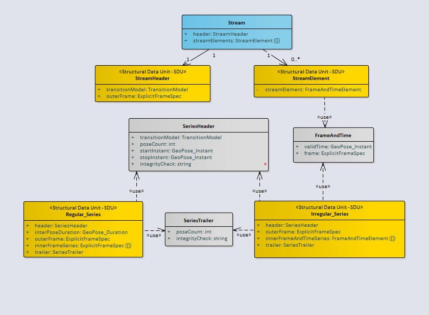

== Logical Model

=== General

The Frame Transform is the core abstraction in the GeoPose Standard. The Frame Transform is a representation of the transformation taking an Outer Frame coordinate system to an Inner Frame coordinate system. This abstraction is constrained in GeoPose v1.0 to only allow transformations involving translation and rotation. The intention is to match the usual concept of a pose as a position and orientation. The formalism that expresses a GeoPose Frame Transform is a pair of Reference Frames, Outer and Inner, each defined by a Frame Specification. The Logical Model relates these elements to represent different types of GeoPose data objects and also defines structures built of time series and linked GeoPoses.

=== UML Logical Model

The normative expression of the UML model is a Sparx Systems Enterprise Explorer link:https://github.com/opengeospatial/GeoPose/blob/main/standard/standard/models/Model.eapx[project ("eapx") file].

The Logical Model consists of four top-level packages: Core, Time, Sequence, and Targets. The Targets package contains two detail packages: Basic and Composite. The Composite package is in turn subdivided into a Linked package and a Sequence package. The Basic GeoPose targets depend on only the Core package. The Advanced GeoPose target also depends on the Time Package. Composite GeoPoses depend on all four top-level packages.

The coloring of the classes indicates their role in the logical design. Note that the classes and data types defined in the Target packages are the source of structural data units (SDUs) that may be realized as concrete data objects.

==== Core

The Logical Model Core contains the essential elements specific to the GeoPose modelled as a transformation between an anchoring Outer Frame and one or more derived Inner Frames. This is described in <<core_logical_model>>.

[[core_logical_model]]
.Core logical model

==== Time

The time logical model is based on <<owl-time>>.

Only relevant classes, properties, and associations are included. GeoPose v1.0 has a very restricted idea of time position, limited to seconds of UNIX Time. This is described in <<time_logical_model>>.

[[time_logical_model]]
.Time logical model
image::models/Logical_time.png[]

==== Sequence

The sequence logical model defines a method for packaging of GeoPose data, where multiple GeoPoses in a sequence share the same {{outer frame}} and there is a time-dependent changing {{inner frame}}. This is displayed in <<sequence_logical_model>>.

[[sequence_logical_model]]
.Sequence logical model

==== Targets

The Logical Model's Targets package specify the design of logical data objects and data types that are directly expressed in GeoPose data objects.

The Basic-YPR, Basic-Quaternion, and the Advanced GeoPose SDUs represent single GeoPose objects.

[[basic_advanced_logical_model]]
.Basic and Advanced Structural Data Units
image::models/Logical_Target_Basic_Advanced.png[]

The Chain and the Graph GeoPose composite structures respectively represent linear or branching frame transformation relationships.

[[chain_graph_logical_model]]
.Chain and Graph Structural Data Units

The Stream and each of the two Series composite structures represent time series of a single evolving GeoPose.

[[series_and_stream_model]]
.Series and Stream Structural Data Units

[NOTE]
The _integrityCheck_ attributes in the SeriesHeader and SeriesTrailer classes are defined as strings and have no prescribed method of use in GeoPose 1.0. They are placeholders to allow experimentation and possible standardization in a later version.

== Structural Data Units and Standardization Targets

=== General

Classes, attributes, and relationships of the GeoPose domain are specified in a (normative) GeoPose UML static class model - the GeoPose Logical Model. Standardization Targets are specified by encoding-neutral elements of the Logical Model. These Structural Data Units (SDUs) are elements (classes or attributes) in the Logical Model with the "Structural Data Unit - SDU" stereotype. SDUs may have additional Requirements limiting the range, multiplicity, representation or other constraining and testable characteristics. SDUs are used individually or in combination combined to express each of the Standardization Targets.

SDUs provide Standardization Targets that are independent of serialization/encoding format. This allows multiple equivalent serializations to be defined. Each SDU that may be expressed as a concrete data object is associated with a corresponding element (class or attribute) in the logical model.

The Basic and Advanced Standardization Targets differ in the level of options and flexibility in the Frame Specifications. The Composite Targets offer approaches to packaging Frame Transforms. The Targets are the data classes that are specified by the GeoPose Standard. There are eight Standardization Targets denoted by bold terms in the following categories:

. Basic - Satisfy most use cases
.. Orientation by Yaw, Pitch, and Roll (YPR) rotations about z, y, x axes: *Basic-YPR* Target
.. Orientation by unit quaternion: *Basic-Quaternion* Target
. Configurable - Flexible enough for complex use cases including full 6DoF transformations: *Advanced* Target
. Composite - Efficient structures for linked and sequential GeoPoses
.. Linked linear sequence of poses linked by full 6DoF transformations: *Chain* Target
.. General linked poses: *Graph* Target
.. Sequence
... Series
.... Time series with constant time spacing: *Regular* Time series Target
.... Time series with per-GeoPose time: *Irregular* Time series Target
... Open-ended sequence of time-stamped GeoPoses: *Stream* Target

[NOTE]
The definition of a reference frame by an external standard in *not* specified. GeoPose does use a three-part designation of an external frame specification using the three fields _authority_, _ID_, and _parameters_. The interpretation of the contents of these fields is outside the scope of GeoPose.

=== Global Requirements

Global requirements apply to all SDUs and Standardization Targets.

include::req/global.adoc[]

The individual global requirements are defined as follows:

include::req/target_dependency.adoc[]

include::req/sdu_general.adoc[]

include::req/lm_general.adoc[]

==== Requirements for Standardization Target 1: Basic-YPR

The Basic-YPR Target has a simple structure with no options. Position is specified as a point in an LTP-ENU frame and rotation is specified by yaw, pitch, and roll angles specified in decimal degrees.

[[basic_ypr_sdu]]
.Structure of the Basic YPR SDU

include::req/basic_ypr.adoc[]

Details of the individual requirements are listed below:

include::req/basic_ypr/target.adoc[]

include::req/tangent_plane/longitude.adoc[]

include::req/tangent_plane/latitude.adoc[]

include::req/tangent_plane/h.adoc[]

include::req/orientation/ypr_angles.adoc[]

==== Requirements for Standardization Target 2: Basic-Quaternion

The Basic-Quaternion Target has a simple structure with no options. Position is specified as a point in an LTP-ENU frame and rotation is specified as a unit quaternion.

[[basic_quaternion_sdu]]
.Structure of the Basic Quaternion SDU
image::diagram/Basic-Quaternion_SDU.PNG[]

include::req/basic_quaternion.adoc[]

Details of the individual requirements are listed below:

include::req/orientation/quaternion.adoc[]

[[common-frame-specification]]
==== Common requirements for frame specification

include::req/frame_specification/authority.adoc[]

include::req/frame_specification/id.adoc[]

include::req/frame_specification/parameters.adoc[]

==== Requirements for Standardization Target 3: Advanced

The Advanced Target has a more general structure, supporting flexible specification of Outer Frame and a Valid Time.

.Structure of the Basic Advanced SDU
image::diagram/Advanced_SDU.PNG[]

include::req/advanced.adoc[]

include::req/time/instant.adoc[]

This target also depends on requirements stated in <<common-frame-specification>>.

==== Requirements for Standardization Target 4: Graph

The Graph Target supports a network of object relative poses. The graph is a directed acyclic graph, each node must either be an Extrinsic Frame or reachable from an Extrinsic Frame.

.Structure of the Graph SDU
image::diagram/Graph_SDU.PNG[]

include::req/graph.adoc[]

include::req/chain/index.adoc[]

This target also depends on requirements stated in <<common-frame-specification>>.

==== Requirements for Standardization Target 5: Chain

The Chain Target supports relationships between a linear sequence of pose relationships. The first frame in the sequence must be an Outer Frame.

.Structure of the Chain SDU
image::diagram/Chain_SDU.PNG[]

include::req/chain.adoc[]

This target also depends on requirements stated in <<common-frame-specification>>.

==== Requirements for Standardization Target 6: Regular Series

The Regular (Time) Series Target represents the time evolution of a single GeoPose, with a constant time duration between successive inner frames.

.Structure of the Regular Series SDU
image::diagram/Regular-Series_SDU.PNG[]

include::req/regular_series.adoc[]

include::req/regular_series/header.adoc[]

include::req/time/duration.adoc[]

include::req/regular_series/trailer.adoc[]

This target also depends on requirements stated in <<common-frame-specification>>.

==== Requirements for Standardization Target 7: Irregular Series

The Irregular (Time) Series Target represents the time evolution of a single GeoPose, with a variable time duration between successive inner frames.

.Structure of the Irregular Series SDU
image::diagram/Irregular-Series_SDU.PNG[]

include::req/irregular_series.adoc[]

include::req/irregular_series/header.adoc[]

include::req/irregular_series/frame_and_time.adoc[]

include::req/regular_series/trailer.adoc[]

This target also depends on requirements stated in <<common-frame-specification>>.

==== Requirements for Standardization Target 8: Stream

The Stream target consists of two parts: a single initial specification of a transition model and an outer frame (the Stream Header) and zero or more time-stamped frame specifications (the Stream Elements). In the delivery of a stream the Header and Elements are not part of a single data structure that exists at a single instant. Nevertheless, recording the Header and all of the Elements received up to some point in time in a single structure is possible. The result is that there are two kinds of data objects that may be involved in transmission of a stream: Headers and Elements and a third kind of object that represents a Recorded Stream.

.Structure of the Stream Header SDU
image::diagram/Stream-Header_SDU.PNG[]

.Structure of the Stream Element SDU
image::diagram/Stream-Element_SDU.PNG[]

include::req/stream.adoc[]

include::req/transition_model.adoc[]

include::req/stream/frame_time_element.adoc[]

This target also depends on requirements stated in <<common-frame-specification>>.

== Requirements for Encodings

=== General

Requirements Classes are modularized based on the corresponding Standardization Target. This results in some SDU requirements being repeated between Targets. SDU requirements are abstract in the sense that SDUs are implemented as concrete data objects via serialization formats or encodings. Therefore, there are additional requirements that specify how each Target's group of SDUs are encoded. If there are multiple encodings of a Target, then there is a corresponding additional set of encoding requirements in the Target's section. This occurs only once in GeoPose 1.0, with two different levels of JSON encoding strictness individually specified for the Basic-Q Target.

=== JSON Encoding

==== General

The JSON encoding is one of many possible ways of implementing a concrete representation of any one or more of the GeoPose Standardization Targets. The specific JSON encoding in this section follows all of the normal rules and conventions of JSON. For example, the order of named properties is not significant and, except in the case of the "strict" Basic-Quaternion object, there is no restriction on adding additional properties not specified in the GeoPose 1.0 Standard. In addition to supporting specific application requirements outside the GeoPose 1.0 scope, this flexibility enables experimentation with useful properties that might be part of a future version of the OGC GeoPose Standard.

==== Standardization Target 1: Basic-YPR

include::req/basic_ypr/encoding/json.adoc[]

[[basic_ypr_json_schema]]
[source,json]
.Basic-YPR: JSON encoding schema
----
include::schemata/GeoPose.Basic.YPR.Schema.json[]
----

[example]
====
[source,json]
----
include::instances/GeoPose.Basic.YPR.Instance.00.json[]
----
====

==== Standardization Target 2: Basic-Quaternion

Two JSON encodings are defined for the Basic-Quaternion Target:

*Strict*:: disallowing additional JSON properties not defined in the schema

*Extensible*:: allowing additional JSON properties in addition to those required
by the schema.

All other targets follow the default and permit additional JSON properties.

===== Strict JSON Encoding

include::req/basic_quaternion/encoding/json_strict.adoc[]

[[basic_quaternion_strict_json_schema]]
[source,json]
.Basic-Quaternion: Strict JSON encoding schema
----
include::schemata/GeoPose.Basic.Strict_Quaternion.Schema.json[]
----

[example]
====
[source,json]
----
include::instances/GeoPose.Basic.Strict_Quaternion.Instance.00.json[]
----
====

===== Permissive JSON Encoding

This JSON encoding of the Basic-Quaternion GeoPose is extensible because the JSON-Schema "additionalProperties" property is set to the default value of *true*. This encoding is intended to be the default GeoPose.

include::req/basic_quaternion/encoding/json.adoc[]

[[basic_quaternion_permissive_json_schema]]
[source,json]
.Basic-Quaternion: Permissive JSON encoding schema
----
include::schemata/GeoPose.Basic.Strict_Quaternion.Schema.json[]
----

[example]
====
[source,json]
----
include::instances/GeoPose.Basic.Quaternion.Instance.00.json[]
----
====

==== Standardization Target 3: Advanced GeoPose

include::req/advanced/encoding/json.adoc[]

[[advanced_geopose_json_schema]]
[source,json]
.Advanced GeoPose: JSON encoding schema
----
include::schemata/GeoPose.Advanced.Schema.json[]
----

[example]
====
[source,json]
----
include::instances/GeoPose.Advanced.Instance.json[]
----
====

==== Standardization Target 4: Graph

include::req/graph/encoding/json.adoc[]

[[graph_json_schema]]
[source,json]
.Graph: JSON encoding schema
----
include::schemata/GeoPose.Composite.Graph.Schema.json[]
----

[example]
====
[source,json]
----
include::instances/GeoPose.Composite.Graph.Instance.json[]
----
====

==== Standardization Target 5: Chain

include::req/chain/encoding/json.adoc[]

[[chain_json_schema]]
[source,json]
.Chain: JSON encoding schema
----
include::schemata/GeoPose.Composite.Chain.Schema.json[]
----

[example]
====
[source,json]
----
include::instances/GeoPose.Composite.Chain.Instance.json[]
----
====

==== Standardization Target 6: Regular Series

include::req/regular_series/encoding/json.adoc[]

[[regular_series_json_schema]]
[source,json]
.Regular series: JSON encoding schema
----
include::schemata/GeoPose.Composite.Sequence.Series.Regular.Schema.json[]
----

[example]
====
[source,json]
----
include::instances/GeoPose.Composite.Sequence.Series.Regular.Instance.json[]
----
====

==== Standardization Target 7: Irregular Series

include::req/irregular_series/encoding/json.adoc[]

[[irregular_series_json_schema]]
[source,json]
.Irregular series: JSON encoding schema
----
include::schemata/GeoPose.Composite.Sequence.Series.Irregular.Schema.json[]
----

[example]
====
[source,json]
----
include::instances/GeoPose.Composite.Sequence.Series.Irregular.Instance.json[]
----
====

==== Standardization Target 8: Stream

include::req/stream/header/encoding/json.adoc[]

[[streamheader_json_schema]]
[source,json]
.Stream header: JSON encoding schema
----
include::schemata/GeoPose.Composite.Sequence.StreamHeader.Schema.json[]
----

include::req/stream/element/encoding/json.adoc[]

[[streamelement_json_schema]]
[source,json]
.Stream element: JSON encoding schema
----
include::schemata/GeoPose.Composite.Sequence.StreamElement.Schema.json[]
----

include::req/stream/record/encoding/json.adoc[]

[[streamrecord_json_schema]]
[source,json]
.Stream record: JSON encoding schema
----
include::schemata/GeoPose.Composite.Sequence.Stream.Schema.json[]
----

[example]
.Valid JSON encoding of a Stream Header instance
====
[source,json]
----
include::instances/GeoPose.Composite.Sequence.StreamHeader.Instance.json[]
----
====

[example]
.Valid JSON encoding of a Stream Element instance
====
[source,json]
----
include::instances/GeoPose.Composite.Sequence.StreamElement.Instance.json[]
----
====

[example]
.Valid JSON encoding of a Recorded Stream
====
[source,json]
----
include::instances/GeoPose.Composite.Sequence.Stream.Instance.json[]
----
====
