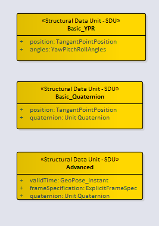

== Logical Model

=== General

The Frame Transform is the core abstraction in the GeoPose Standard. The Frame Transform is a representation of the transformation taking an Outer Frame coordinate system to an Inner Frame coordinate system. This abstraction is constrained in GeoPose v1.0 to only allow transformations involving translation and rotation. The intention is to match the usual concept of a pose as a position and orientation. The formalism that expresses a GeoPose Frame Transform is a pair of Reference Frames, Outer and Inner, each defined by a Frame Specification. The Logical Model relates these elements to represent different types of GeoPose data objects and also defines structures built of time series and linked GeoPoses.

=== UML Logical Model

The normative expression of the UML model is a Sparx Systems Enterprise Explorer project ("eapx") file located at:

* link:https://github.com/opengeospatial/GeoPose/blob/main/standard/standard/models/Model.eapx[]

The Logical Model consists of four top-level packages: Core, Time, Sequence, and Targets. The Targets package contains two detail packages: Basic and Composite. The Composite package is in turn subdivided into a Linked package and a Sequence package. The Basic GeoPose targets depend on only the Core package. The Advanced GeoPose target also depends on the Time Package. Composite GeoPoses depend on all four top-level packages.

The coloring of the classes indicates their role in the logical design. Note that the classes and data types defined in the Target packages are the source of structural data units (SDUs) that may be realized as concrete data objects.

==== Core

The Logical Model Core contains the essential elements specific to the GeoPose modelled as a transformation between an anchoring Outer Frame and one or more derived Inner Frames. This is described in <<core_logical_model>>.

[[core_logical_model]]
.Core logical model
image::models/Logical_Core.png[]

==== Time

The time logical model is based on <<owl-time>>.

Only relevant classes, properties, and associations are included. GeoPose v1.0 has a very restricted idea of time position, limited to seconds of UNIX Time. This is described in <<time_logical_model>>.

[[time_logical_model]]
.Time logical model

==== Sequence

The sequence logical model defines a method for packaging of GeoPose data, where multiple GeoPoses in a sequence share the same {{outer frame}} and there is a time-dependent changing {{inner frame}}. This is displayed in <<sequence_logical_model>>.

[[sequence_logical_model]]
.Sequence logical model
image::models/Logical_Sequence.png[]

==== Targets

The Logical Model's Targets package specify the design of logical data objects and data types that are directly expressed in GeoPose data objects.

The Basic-YPR, Basic-Quaternion, and the Advanced GeoPose SDUs represent single GeoPose objects.

[[basic_advanced_logical_model]]
.Basic and Advanced Structural Data Units

The Chain and the Graph GeoPose composite structures respectively represent linear or branching frame transformation relationships.

[[chain_graph_logical_model]]
.Chain and Graph Structural Data Units
image::models/Logical_Target_Linked.png[]

The Stream and each of the two Series composite structures represent time series of a single evolving GeoPose.

[[series_and_stream_model]]
.Series and Stream Structural Data Units
image::models/Logical_Target_Sequence.png[]

[NOTE]
The _integrityCheck_ attributes in the SeriesHeader and SeriesTrailer classes are defined as strings and have no prescribed method of use in GeoPose 1.0. They are placeholders to allow experimentation and possible standardization in a later version.

