[#IntuitiveGeoPose]#IntuitiveGeoPose:#

image:diagram/IntuitiveGeoPose.png[image,width=355,height=37]

referenced by:

* link:#DiscussionImplementationTargets[DiscussionImplementationTargets]

 +

[#BasicGeoPose]#BasicGeoPose:#

image:diagram/BasicGeoPose.png[image,width=351,height=37]

referenced by:

* link:#DiscussionImplementationTargets[DiscussionImplementationTargets]

 +

[#TemporalGeoPose]#TemporalGeoPose:#

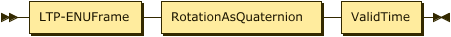

referenced by:

* link:#DiscussionImplementationTargets[DiscussionImplementationTargets]

 +

[#AdvancedGeoPose]#AdvancedGeoPose:#

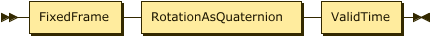

referenced by:

* link:#DiscussionImplementationTargets[DiscussionImplementationTargets]

 +

[#CombinedBasic-Persistent-AdvancedGeoPoseTargets]#CombinedBasic-Persistent-AdvancedGeoPoseTargets:#

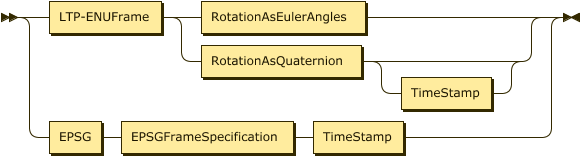

no references

 +

[#DiscussionImplementationTargets]#DiscussionImplementationTargets:#

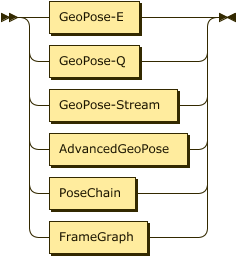

no references

 +

[#RotationAsEulerAngles]#RotationAsEulerAngles:#

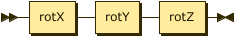

referenced by:

* link:#CombinedBasic-Persistent-AdvancedGeoPoseTargets[CombinedBasic-Persistent-AdvancedGeoPoseTargets]
* link:#IntuitiveGeoPose[IntuitiveGeoPose]

 +

[#RotationAsQuaternion]#RotationAsQuaternion:#

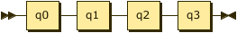

referenced by:

* link:#AdvancedGeoPose[AdvancedGeoPose]
* link:#BasicGeoPose[BasicGeoPose]
* link:#CombinedBasic-Persistent-AdvancedGeoPoseTargets[CombinedBasic-Persistent-AdvancedGeoPoseTargets]
* link:#TemporalGeoPose[TemporalGeoPose]
* link:#Translate-RotateFrameSpecification[Translate-RotateFrameSpecification]

 +

[#ValidTime]#ValidTime:#

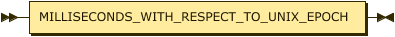

referenced by:

* link:#AdvancedGeoPose[AdvancedGeoPose]
* link:#TemporalGeoPose[TemporalGeoPose]

 +

[#PoseChain]#PoseChain:#

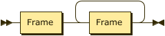

referenced by:

* link:#DiscussionImplementationTargets[DiscussionImplementationTargets]

 +

[#FrameGraph]#FrameGraph:#

image:diagram/FrameGraph.png[image,width=563,height=71]

referenced by:

* link:#DiscussionImplementationTargets[DiscussionImplementationTargets]

 +

[#FrameTransform]#FrameTransform:#

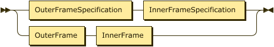

referenced by:

* link:#FrameGraph[FrameGraph]

 +

[#Frame]#Frame:#

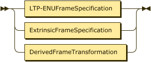

referenced by:

* link:#FrameGraph[FrameGraph]
* link:#InnerFrame[InnerFrame]
* link:#OuterFrame[OuterFrame]
* link:#PoseChain[PoseChain]

 +

[#OuterFrame]#OuterFrame:#

image:diagram/OuterFrame.png[image,width=119,height=37]

referenced by:

* link:#FrameTransform[FrameTransform]

 +

[#InnerFrame]#InnerFrame:#

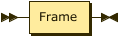

referenced by:

* link:#FrameTransform[FrameTransform]

 +

[#FixedFrame]#FixedFrame:#

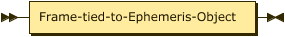

referenced by:

* link:#AdvancedGeoPose[AdvancedGeoPose]

 +

[#FrameSpecificationType]#FrameSpecificationType:#

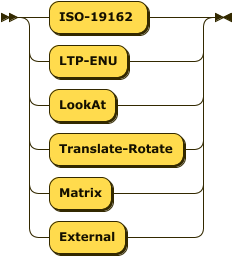

referenced by:

* link:#Frame[Frame]

 +

[#FrameSpecification]#FrameSpecification:#

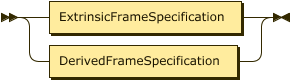

referenced by:

* link:#Frame[Frame]

 +

[#LTP-ENUFrameSpecification]#LTP-ENUFrameSpecification:#

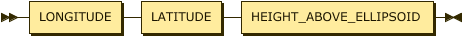

referenced by:

* link:#FrameSpecification[FrameSpecification]

 +

[#EPSGFrameSpecification]#EPSGFrameSpecification:#

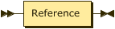

referenced by:

* link:#CombinedBasic-Persistent-AdvancedGeoPoseTargets[CombinedBasic-Persistent-AdvancedGeoPoseTargets]
* link:#FrameSpecification[FrameSpecification]

 +

[#LookAtFrameSpecification]#LookAtFrameSpecification:#

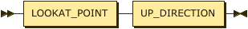

referenced by:

* link:#FrameSpecification[FrameSpecification]

 +

[#Translate-RotateFrameSpecification]#Translate-RotateFrameSpecification:#

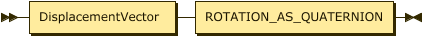

referenced by:

* link:#FrameSpecification[FrameSpecification]

 +

[#MatrixFrameSpecification]#MatrixFrameSpecification:#

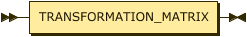

referenced by:

* link:#FrameSpecification[FrameSpecification]

 +

[#ExternalFrameSpecification]#ExternalFrameSpecification:#

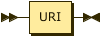

referenced by:

* link:#FrameSpecification[FrameSpecification]

 +

[#URI]#URI:#

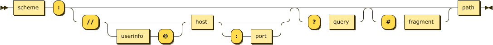

referenced by:

* link:#ExternalFrameSpecification[ExternalFrameSpecification]

 +

[#Uncertainty]#Uncertainty:#

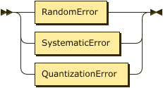

no references

 +

[#RandomError]#RandomError:#

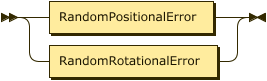

referenced by:

* link:#Uncertainty[Uncertainty]

 +

[#RandomPositionalError]#RandomPositionalError:#

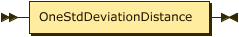

referenced by:

* link:#RandomError[RandomError]

 +

[#RandomRotationalError]#RandomRotationalError:#

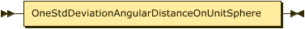

referenced by:

* link:#RandomError[RandomError]

 +

[#QuantizationError]#QuantizationError:#

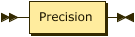

referenced by:

* link:#Uncertainty[Uncertainty]

 +

[#Precision]#Precision:#

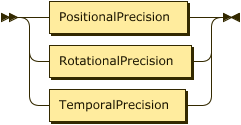

referenced by:

* link:#QuantizationError[QuantizationError]

 +

[#PositionalPrecision]#PositionalPrecision:#

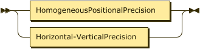

referenced by:

* link:#Precision[Precision]

 +

[#HomogeneousPositionalPrecision]#HomogeneousPositionalPrecision:#

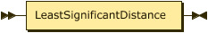

referenced by:

* link:#PositionalPrecision[PositionalPrecision]

 +

[#Horizontal-VerticalPrecision]#Horizontal-VerticalPrecision:#

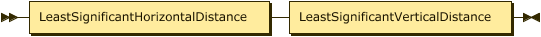

referenced by:

* link:#PositionalPrecision[PositionalPrecision]

 +

[#RotationalPrecision]#RotationalPrecision:#

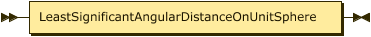

referenced by:

* link:#Precision[Precision]

 +

[#TemporalPrecision]#TemporalPrecision:#

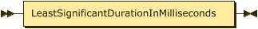

referenced by:

* link:#Precision[Precision]

 +
