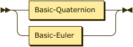

[#ImplementationTargets]#ImplementationTargets:#

[NOTE]
====
I have rewritten the first three using all capitals casing for terminal symbols. Terminal symbols are the structural elements that are actually mapped into a serialization format or encoding.

I have also simplified the frame specifications and given all exterinsic frame specifications the same structure: authority - id - parameters.

We can include a table of the ones that we address directly in the standard:

. EPSG -> epsg.org | code | parameters

. Proj strings -> proj.org | epsg code | parameters

. ISO 19162 -> ogc.org | -  parameters

. NASA SPICE -> naif.jpl.nasa.gov | id | parameters

. another

====

image:./diagram/ImplementationTargets.png[image,width=187,height=125]

no references

 +

[#Basic]#Basic:#

referenced by:

* link:#ImplementationTargets[ImplementationTargets]

 +

[#Composite]#Composite:#

image:diagram/Composite.png[image,width=181,height=125]

referenced by:

* link:#ImplementationTargets[ImplementationTargets]

 +

[#Basic-YPR]#Basic-YPR:#

image:diagram/Basic-YPR.png[image,width=737,height=125]

referenced by:

* link:#Basic[Basic]

 +

[#Basic-Quaternion]#Basic-Quaternion:#

image:diagram/Basic-Quaternion.png[image,width=721,height=125]

referenced by:

* link:#Basic[Basic]

 +

[#Advanced]#Advanced:#

image:diagram/Advanced.png[image,width=1195,height=125]

referenced by:

* link:#ImplementationTargets[ImplementationTargets]

 +

[#ShouldWeHaveProperties]#ShouldWeHaveProperties:#

image:diagram/ShouldWeHaveProperties.png[image,width=257,height=69]

referenced by:

* link:#Advanced[Advanced]

 +

[#Sequence]#Sequence:#

image:diagram/Sequence.png[image,width=221,height=81]

referenced by:

* link:#Composite[Composite]

 +

[#Chain]#Chain:#

image:diagram/Chain.png[image,width=239,height=53]

referenced by:

* link:#Composite[Composite]

 +

[#Graph]#Graph:#

image:diagram/Graph.png[image,width=563,height=71]

referenced by:

* link:#Composite[Composite]

 +

[#GeoPoseSeries]#GeoPoseSeries:#

image:diagram/GeoPoseSeries.png[image,width=213,height=81]

referenced by:

* link:#Sequence[Sequence]

 +

[#GeoPoseStream]#GeoPoseStream:#

image:diagram/GeoPoseStream.png[image,width=361,height=37]

referenced by:

* link:#Sequence[Sequence]

 +

[#RegularSeries]#RegularSeries:#

image:diagram/RegularSeries.png[image,width=461,height=37]

referenced by:

* link:#GeoPoseSeries[GeoPoseSeries]

 +

[#RegularSeriesHeader]#RegularSeriesHeader:#

image:diagram/RegularSeriesHeader.png[image,width=321,height=37]

referenced by:

* link:#RegularSeries[RegularSeries]

 +

[#SeriesHeader]#SeriesHeader:#

image:diagram/SeriesHeader.png[image,width=599,height=37]

referenced by:

* link:#IrregularPoseSeries[IrregularPoseSeries]
* link:#RegularSeriesHeader[RegularSeriesHeader]

 +

[#PoseCount]#PoseCount:#

image:diagram/PoseCount.png[image,width=131,height=37]

referenced by:

* link:#SeriesHeader[SeriesHeader]
* link:#SeriesTrailer[SeriesTrailer]

 +

[#StartInstant]#StartInstant:#

image:diagram/StartInstant.png[image,width=139,height=37]

referenced by:

* link:#SeriesHeader[SeriesHeader]

 +

[#StopInstant]#StopInstant:#

image:diagram/StopInstant.png[image,width=139,height=37]

referenced by:

* link:#SeriesHeader[SeriesHeader]

 +

[#TransitionModel]#TransitionModel:#

image:diagram/TransitionModel.png[image,width=195,height=81]

referenced by:

* link:#SeriesHeader[SeriesHeader]
* link:#StreamHeader[StreamHeader]

 +

[#SeriesContent]#SeriesContent:#

image:diagram/SeriesContent.png[image,width=305,height=37]

referenced by:

* link:#RegularSeries[RegularSeries]

 +

[#InnerFrameSeries]#InnerFrameSeries:#

image:diagram/InnerFrameSeries.png[image,width=237,height=37]

referenced by:

* link:#SeriesContent[SeriesContent]

 +

[#FrameSpecificationSeries]#FrameSpecificationSeries:#

image:diagram/FrameSpecificationSeries.png[image,width=237,height=53]

referenced by:

* link:#InnerFrameSeries[InnerFrameSeries]

 +

[#SeriesTrailer]#SeriesTrailer:#

image:diagram/SeriesTrailer.png[image,width=211,height=37]

referenced by:

* link:#IrregularPoseSeries[IrregularPoseSeries]
* link:#RegularSeries[RegularSeries]

 +

[#IrregularPoseSeries]#IrregularPoseSeries:#

image:diagram/IrregularPoseSeries.png[image,width=473,height=37]

no references

 +

[#GeoPoseAndTimeSeries]#GeoPoseAndTimeSeries:#

image:diagram/GeoPoseAndTimeSeries.png[image,width=359,height=37]

referenced by:

* link:#GeoPoseStream[GeoPoseStream]
* link:#IrregularPoseSeries[IrregularPoseSeries]

 +

[#InnerFrameAndTimeSeries]#InnerFrameAndTimeSeries:#

image:diagram/InnerFrameAndTimeSeries.png[image,width=291,height=37]

referenced by:

* link:#GeoPoseAndTimeSeries[GeoPoseAndTimeSeries]

 +

[#FrameSpecificationAndTimeSeries]#FrameSpecificationAndTimeSeries:#

image:diagram/FrameSpecificationAndTimeSeries.png[image,width=353,height=53]

referenced by:

* link:#InnerFrameAndTimeSeries[InnerFrameAndTimeSeries]

 +

[#StreamHeader]#StreamHeader:#

image:diagram/StreamHeader.png[image,width=267,height=37]

referenced by:

* link:#GeoPoseStream[GeoPoseStream]

 +

[#ValidTime]#ValidTime:#

image:diagram/ValidTime.png[image,width=395,height=37]

referenced by:

* link:#Advanced[Advanced]
* link:#StartInstant[StartInstant]
* link:#StopInstant[StopInstant]

 +

[#FrameTransform]#FrameTransform:#

image:diagram/FrameTransform.png[image,width=267,height=37]

referenced by:

* link:#Graph[Graph]

 +

[#Frame]#Frame:#

image:diagram/Frame.png[image,width=303,height=125]

referenced by:

* link:#Advanced[Advanced]
* link:#Chain[Chain]
* link:#Graph[Graph]
* link:#InnerFrame[InnerFrame]
* link:#OuterFrame[OuterFrame]

 +

[#OuterFrame]#OuterFrame:#

image:diagram/OuterFrame.png[image,width=119,height=37]

referenced by:

* link:#FrameTransform[FrameTransform]
* link:#GeoPoseAndTimeSeries[GeoPoseAndTimeSeries]
* link:#SeriesContent[SeriesContent]

 +

[#InnerFrame]#InnerFrame:#

image:diagram/InnerFrame.png[image,width=119,height=37]

referenced by:

* link:#FrameTransform[FrameTransform]

 +

[#ExtrinsicFrameSpecification]#ExtrinsicFrameSpecification:#

image:diagram/ExtrinsicFrameSpecification.png[image,width=541,height=37]

referenced by:

* link:#Advanced[Advanced]
* link:#Frame[Frame]
* link:#FrameSpecification[FrameSpecification]

 +

[#DerivedFrameSpecification]#DerivedFrameSpecification:#

image:diagram/DerivedFrameSpecification.png[image,width=233,height=125]

referenced by:

* link:#FrameSpecification[FrameSpecification]

 +

[#FrameSpecification]#FrameSpecification:#

image:diagram/FrameSpecification.png[image,width=291,height=81]

referenced by:

* link:#FrameSpecificationAndTimeSeries[FrameSpecificationAndTimeSeries]
* link:#FrameSpecificationSeries[FrameSpecificationSeries]

 +

[#LTP-ENUFrameSpecification]#LTP-ENUFrameSpecification:#

image:diagram/LTP-ENUFrameSpecification.png[image,width=463,height=37]

referenced by:

* link:#Basic-Euler[Basic-Euler]
* link:#Basic-Quaternion[Basic-Quaternion]
* link:#Frame[Frame]

 +

[#LookAtFrameSpecification]#LookAtFrameSpecification:#

image:diagram/LookAtFrameSpecification.png[image,width=309,height=37]

no references

 +

[#Translate-RotateFrameSpecification]#Translate-RotateFrameSpecification:#

image:diagram/Translate-RotateFrameSpecification.png[image,width=423,height=37]

no references

 +

[#MatrixFrameSpecification]#MatrixFrameSpecification:#

image:diagram/MatrixFrameSpecification.png[image,width=247,height=37]

no references

 +

[#ExternalFrameSpecification]#ExternalFrameSpecification:#

image:diagram/ExternalFrameSpecification.png[image,width=101,height=37]

no references

 +

[#DisplacementVector]#DisplacementVector:#

image:diagram/DisplacementVector.png[image,width=137,height=37]

referenced by:

* link:#Translate-RotateFrameSpecification[Translate-RotateFrameSpecification]

 +

[#URI]#URI:#

image:diagram/URI.png[image,width=1087,height=101]

referenced by:

* link:#ExternalFrameSpecification[ExternalFrameSpecification]

 +

[#Uncertainty]#Uncertainty:#

image:diagram/Uncertainty.png[image,width=231,height=125]

no references

 +

[#RandomError]#RandomError:#

image:diagram/RandomError.png[image,width=267,height=81]

referenced by:

* link:#Uncertainty[Uncertainty]

 +

[#RandomPositionalError]#RandomPositionalError:#

image:diagram/RandomPositionalError.png[image,width=239,height=37]

referenced by:

* link:#RandomError[RandomError]

 +

[#RandomRotationalError]#RandomRotationalError:#

image:diagram/RandomRotationalError.png[image,width=377,height=37]

referenced by:

* link:#RandomError[RandomError]

 +

[#QuantizationError]#QuantizationError:#

image:diagram/QuantizationError.png[image,width=135,height=37]

referenced by:

* link:#Uncertainty[Uncertainty]

 +

[#Precision]#Precision:#

image:diagram/Precision.png[image,width=241,height=125]

referenced by:

* link:#QuantizationError[QuantizationError]

 +

[#PositionalPrecision]#PositionalPrecision:#

image:diagram/PositionalPrecision.png[image,width=329,height=81]

referenced by:

* link:#Precision[Precision]

 +

[#HomogeneousPositionalPrecision]#HomogeneousPositionalPrecision:#

image:diagram/HomogeneousPositionalPrecision.png[image,width=233,height=37]

referenced by:

* link:#PositionalPrecision[PositionalPrecision]

 +

[#Horizontal-VerticalPrecision]#Horizontal-VerticalPrecision:#

image:diagram/Horizontal-VerticalPrecision.png[image,width=541,height=37]

referenced by:

* link:#PositionalPrecision[PositionalPrecision]

 +

[#RotationalPrecision]#RotationalPrecision:#

image:diagram/RotationalPrecision.png[image,width=371,height=37]

referenced by:

* link:#Precision[Precision]

 +

[#TemporalPrecision]#TemporalPrecision:#

image:diagram/TemporalPrecision.png[image,width=323,height=37]

referenced by:

* link:#Precision[Precision]

 +

'''''

